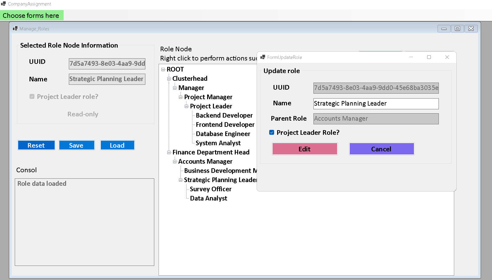
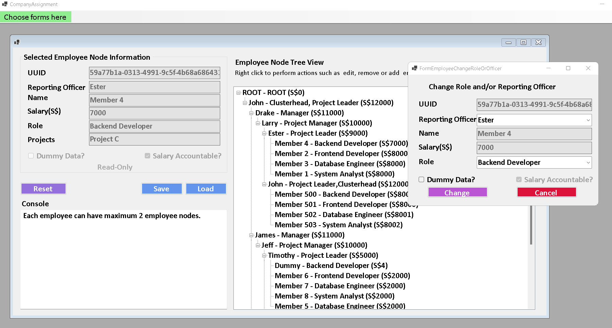
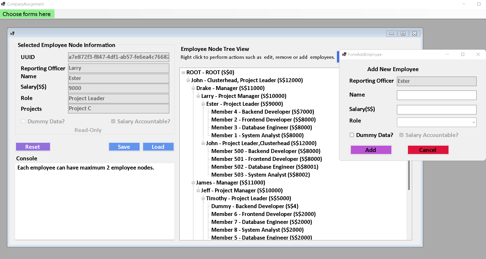
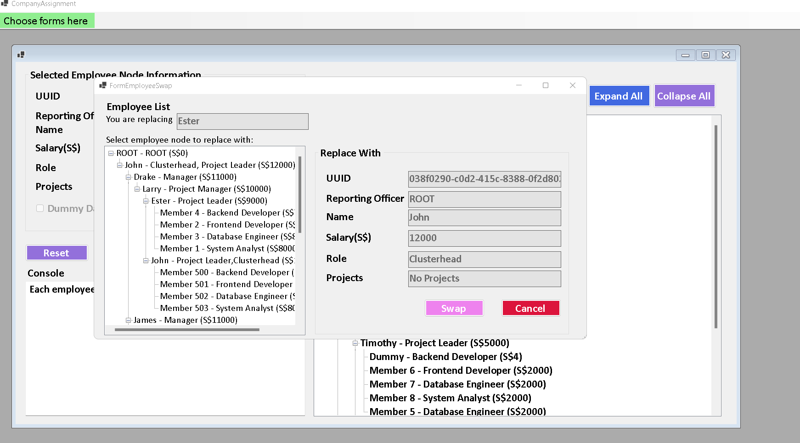
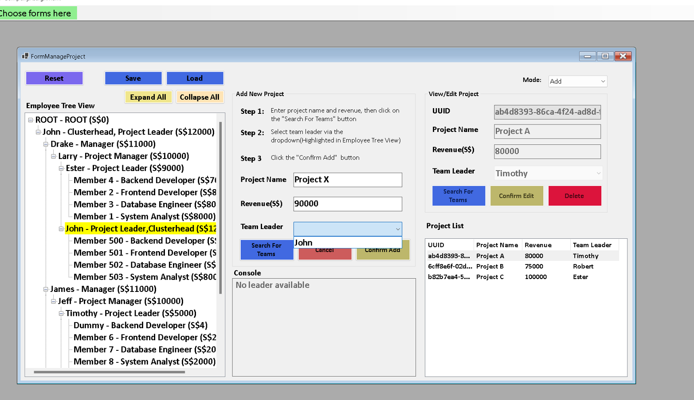

# Company Simulator
Data Structure and Algorithm


+ Role Management
    - Add, update, remove role
    - Save and Load binary file
    
+ Employee Management
    - Add, remove, edit, swap employee position, change reporting officer
    - Save and Load binary file
    
+ Project Management
    - Add, edit, remove project
    - Save and Load binary file
    
> Validations and error handlings implemented


###
Open ``` ExperimentTreeViewV2.sln``` from the root folder using Visual Studio 2022. 
> Then click Play or press F5

### Screenshots
> Role

> Employee



> Project

